The software uses a specific JSON format to read data and produce cards or counters. It can even use counters files to
produce cards using the content of the counters.

# Settings

Settings are common for card teamplates, counter templates, single counters and single cards:

## `"width": (px)`

When used with a template, it defines the max width for the entire template (regardless of the number of
counters or cards). So if defined a 1200 px and a 100px per side counter, you'll get 12 counters per row.

## `"height": (px)`

When used with a template, it defines the max height for the entire template (regardless of the number
of counters or cards). So, if you define a 800px height and your cards are 400px height, then you'll get 2 columns per page.

## `"margins": (px)`

## `"font_height": (px)`

## `"font_path": (string)`

If you want to use a custom font, define the path to load it here.

## `"font_color": (string)`

You can use a hexadecimal format or a string format like "red", "blue".

| `"font_color": "red"`               | `"font_color": "#0F0"`              |
| ----------------------------------- | ----------------------------------- |
| 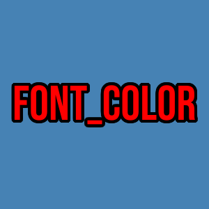 | 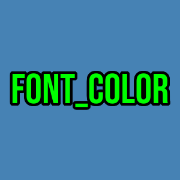 |

```json
{ "texts": [{"string": "font_color", "font_color": "red"}] },
{ "texts": [{"string": "font_color", "font_color": "#0F0"}] },
```

## `"background_image": (string)`

You can use it in conjunction with the background color.

## `"background_color": (string)`

You can use a hexadecimal format or a string format like "red", "blue".

| `"background_color": "white"`           | `"background_color": "#4682B4"`             |
| --------------------------------------- | ------------------------------------------- |
|  | 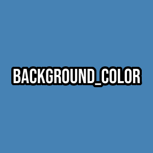 |

```json
    {
      "background_color": "white",
      "texts": [
        {"string": "background_color", "font_height": 40, "avoid_clipping": true}
      ]
    },
    {
      "background_color": "#4682B4",
      "texts": [
        {"string": "background_color", "font_height": 40, "avoid_clipping": true}
      ]
    }
```

## `"shadow": (px)`

If not zero, it will project a shadow to the bottom-right part.

| `"shadow": 0`                   | `"shadow": 5`                   | `"shadow": 10`                      |
| ------------------------------- | ------------------------------- | ----------------------------------- |
| 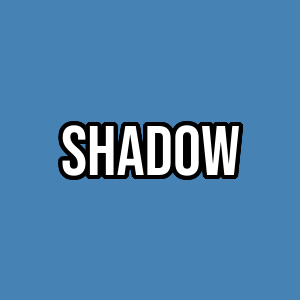 | 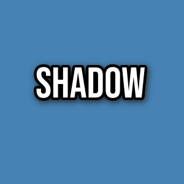 | 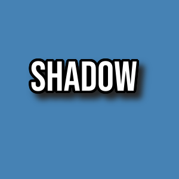 -- |

```json
{"texts": [{"string": "shadow", "shadow": 0}]},
{"texts": [{"string": "shadow", "shadow": 3}]},
{"texts": [{"string": "shadow", "shadow": 10}]},
```

## `"rotation": (degrees)`

(numeric, degrees): If you need to rotate the image for whatever reason

```json
{"texts": [{"string": "rotation", "rotation": 45}]},
```

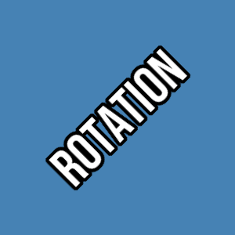

- `"border_width": (px)`
  (Only cards) Define a border width for the card.

## `"border_color": (px)`

(Only cards) Define the color of the border.

## `"x_shift": (px)`

Displace the image in the `x` axis (left or right).

| "x_shift": 0                     | "x_shift": 70                     |
| -------------------------------- | --------------------------------- |
| 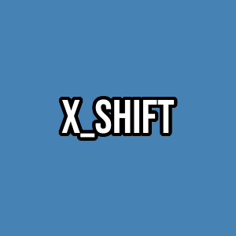 | 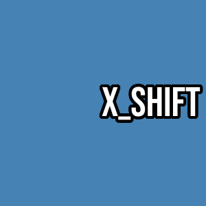 |

```json
    {"texts": [{"string": "x_shift", "x_shift": 0, "font_height": 60}]},
    {"texts": [{"string": "x_shift", "x_shift": 70, "font_height": 60}]},
```

## `"y_shift": (px)`

Displace the image in the `y` axis (up or down).

| "y_shift": 0                     | "y_shift": 70                      |
| -------------------------------- | ---------------------------------- |
| 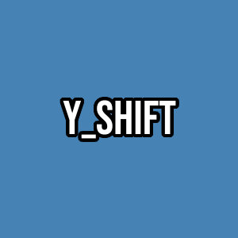 | 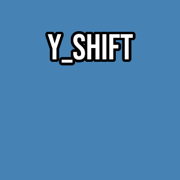 |

```json
    {"texts": [{"string": "y_shift", "y_shift": 0, "font_height": 60}]},
    {"texts": [{"string": "y_shift", "y_shift": -70, "font_height": 60}]},
```

## `multiplier: (numeric)`

On cards or counters, define the number of "clones".

## `stroke_width: (px)`

On fonts, it defines the stroke width.

| "stroke_width": -1                     | "stroke_width": 5                     | "stroke_width": 10                     |
| -------------------------------------- | ------------------------------------- | -------------------------------------- |
|  |  |  |

```json
    {"texts": [{"string": "stroke_width", "stroke_width": -1, "font_height": 50}]},
    {"texts": [{"string": "stroke_width", "stroke_width": 5, "font_height": 50}]},
    {"texts": [{"string": "stroke_width", "stroke_width": 15, "font_height": 50}]},
```

## `"stroke_color": (string)`

On fonts, it defines the stroke color.

| `"stroke_color": "red"`                 | `"stroke_color": "#00F"`                 |
| --------------------------------------- | ---------------------------------------- |
| 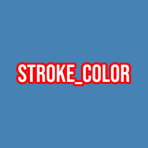 | 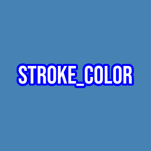 |

```json
    {"texts": [{"string": "stroke_color", "stroke_color": "red", "font_height": 50}]},
    {"texts": [{"string": "stroke_color", "stroke_color": "blue", "font_height": 50}]},
```

## `"alignment": (string)`

Helps in aligning the image: use `center`, `right` or `left`.

## `"image_scaling": (string)`

On images, it defines the way to scale it. `fitWidth`, `wrap` or `fitHeight`

## `"avoid_clipping": (boolean)`

On fonts, it helps with some fonts that have too little space. If you see problems in some
font when using long texts, try to set this to true to see if it helps.


```json
    {"texts": [{"string": "avoid _ clipping", "avoid_clipping": true, "font_height": 70}]},
```

- `position` (numeric from 0 to 16): A position in the card/counter. Starting in the top-left corner having "Position"
  `1` and moving clockwise, each side in a counter or card has 5 positions. For example the top border is: 1 left,
  2 left-center, 3 center, 4 right-center and 5 right. The same in top down: 5 top (right), 6 top-middle, 7 middle,
  8 bottom-middle, 9 bottom.

| `"position": 13`                   | The 17 possible positions           |
| ---------------------------------- | ----------------------------------- |
| 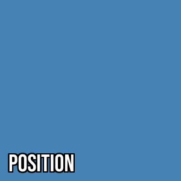 | 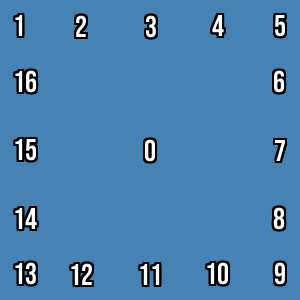 |

```json
    {"texts": [
      {"string": "0", "font_height":30, "stroke_width":3},
      {"position": 1, "string": "1", "font_height":30, "stroke_width":3},
      {"position": 2, "string": "2", "font_height":30, "stroke_width":3},
      {"position": 3, "string": "3", "font_height":30, "stroke_width":3},
      {"position": 4, "string": "4", "font_height":30, "stroke_width":3},
      {"position": 5, "string": "5", "font_height":30, "stroke_width":3},
      {"position": 6, "string": "6", "font_height":30, "stroke_width":3},
      {"position": 7, "string": "7", "font_height":30, "stroke_width":3},
      {"position": 8, "string": "8", "font_height":30, "stroke_width":3},
      {"position": 9, "string": "9", "font_height":30, "stroke_width":3},
      {"position": 10, "string": "10", "font_height":30, "stroke_width":3},
      {"position": 11, "string": "11", "font_height":30, "stroke_width":3},
      {"position": 12, "string": "12", "font_height":30, "stroke_width":3},
      {"position": 13, "string": "13", "font_height":30, "stroke_width":3},
      {"position": 14, "string": "14", "font_height":30, "stroke_width":3},
      {"position": 15, "string": "15", "font_height":30, "stroke_width":3},
      {"position": 16, "string": "16", "font_height":30, "stroke_width":3}
    ]},
    {"texts": [{"position": 13, "string": "position", "font_height": 40, "stroke_width":3}]},
```

- `skip_borders`: Borders can be skipped, it is useful sometimes when wanting to know exactly how an entity will look
  into the counter or card.

- `scaling:` (decimal): A scaling factor for the entire counter. All values in settings, font size, margins, stroke widths, etc. will be scaled appropriately. Use this when you have a working template with some values but you need it 1.5 bigger or smaller. Instead of "redrawing" every value and image one by one, just use `scaling` and let the magic happens. This is useful for example to create you counters ready for printing, but then you can scale them down and make them smaller for Vassal.

## Cards template

A card template is used to generate cards using a JSON file. The possible configuration is the following:

- `settings`: All the fields defined above.
- `rows` (integer): Number of rows of cards/counters.
- `columns` (integer): Number of columns of cards/counters.
- `draw_guides` (boolean): Helpful guides while development.
- `mode`: 2 possible modes: `tiles` or `template`. Template will render a single file for every card. Tiles will use
  the `rows` and `columns` to group cards into a single page.
- `output_path` (string): The file destination in case of using `tiles` mode. At the moment, the filename must contain `%d` somewhere. This is the placeholder for the page number. For example, if you generate 18 cards on 2 sheets of 9 and 9 cards each, you can use this filename `mycards_%d.png` and it will generate two files: `mycards_1.png` and `mycards_2.png`.
- `extra`: See below.

### Extra

- `faction_image`:
- `faction_image_scale`:
- `back_image`:

### Card

- `settings`: See above.
- `areas`: A card is composed of 1 or more areas. Each area is effectively a "counter" and contains all the properties and settings of a single counter.
- `texts`: A card, by itself, is also a "counter". In this sense you can also use it to establish some things at the card level. For example, a consistent border line around the entire card.
- `images`: Images to use at the card level, mostly useful to establish a background image pattern for the entire card.

#### Areas

Each area behaves like a single counter. For example, a Magic The Gathering card has, essentially, 2 areas: an upper area for the creature / land drawing and a lower area for the text and flavour.

In the following example we can see 3 cards:

- The first one is a card with a single area, placed at the left of the image with the text "AREA_1" on it.
- The second is a card with two areas of the same size: This is the card in the middle, with the text "AREA_1" definining the upper area and the text "AREA_2" defining the lower part.
- A third card is at the right of the image, it has 3 areas: the upper one has a blue background color. Because it is like a counter, it has the text placed in Position 13 of the area (see above for description about the "position" property). A second area named "AREA_2" has been defined with a height of 300 pixels. The third area "AREA_3" takes the remaining space.

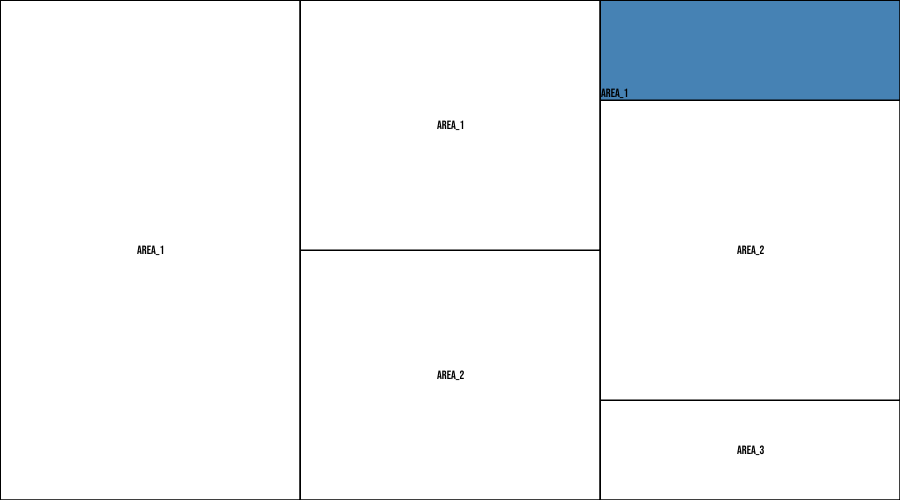

The JSON that generated this image is the following:

```json
{
  "rows": 1,
  "columns": 3,
  "width": 300,
  "height": 500,
  "mode": "tiles",
  "output_path": "docs/cards_%02d.png",
  "border_color": "black",
  "border_width": 1,
  "cards": [
    { "areas": [{ "texts": [{ "string": "area_1" }] }] },
    {
      "areas": [
        { "texts": [{ "string": "area_1" }] },
        { "texts": [{ "string": "area_2" }] }
      ]
    },
    {
      "areas": [
        {
          "background_color": "#4682B4",
          "texts": [{ "string": "area_1", "position": 13 }]
        },
        { "height": 300, "texts": [{ "string": "area_2" }] },
        { "texts": [{ "string": "area_3" }] }
      ]
    }
  ]
}
```

> Important: The number of items inside the `cards` array must match the result of multiplying the numbers in `rows` and `columns`. In the example above, the array has 3 items which is the result of multiplying 3 columns by 1 row.

- `settings`: See above.
- `single_step` (bool): When set to true, the back of a counter won't be printed.
- `frame` (bool): TODO, no idea.
- `images` (list of images):
- `texts`: See above.
- `extra`: See above.

#### Texts

- `string`: The text itself.
- `underline`:

#### Image

- `path`:
- `scale`:
- `avoid_cropping`:

# Tutorials

## Counters

### Generate a series of counters using a prototype

In this example we will generate a series of counters using a prototype. The prototype is a JSON file that defines the `CounterTemplate`. The template must contain a special object: `prototypes`. Each object in the special object is a prototype. The key is the name of the prototype and the value is a `Counter` object. The `Counter` object is the same as the one you can find in `counters` inside a `CounterTemplate`. The objects found in the prototype will be generated in the `counters` array of the `CounterTemplate`. Use the parameter `multiplier` on the prototype to generate more than one object in `counters`. Once executed, it will generate a `json` file to edit and use more generally.

An example prototype can look like the following:

```json
{
  "rows": 7,
  "columns": 7,
  "width": 82,
  "height": 82,
  "font_height": 35,
  "margins": 2,
  "font_color": "black",
  "background_color": "#62929E",
  "mode": "template",
  "output_folder": "my-output-folder",
  "draw_guides": false,
  "stroke_width": -1,
  "stroke_color": "black",
  "image_scaling": "fitWidth",
  "index_number_for_filename": 3,
  "font_path": "assets/font-bebas.ttf",
  "counters": [],
  "prototypes": {
    "default": {
      "multiplier": 2,
      "texts": [
        {
          "position": 3,
          "string": "Proto",
          "font_color": "white",
          "font_height": 20,
          "avoid_clipping": true
        },
        {
          "position": 10,
          "string": "3-8",
          "avoid_clipping": true
        },
        {
          "string": "HQ",
          "font_color": "white",
          "stroke_width": 3,
          "font_height": 30,
          "y_shift": -5,
          "position": 7,
          "avoid_clipping": true
        }
      ],
      "images": [
        {
          "path": "assets/hd12.png",
          "y_shift": -32,
          "image_scaling": "fitWidth"
        }
      ]
    }
  }
}
```

An example command to achieve this is the following:

```bash
counters json -i my_prototype.json -o my_counters.json --output-type counters
```

At the output you'll get looks like this:

```json
{
  "rows": 7,
  "columns": 7,
  "width": 82,
  "height": 82,
  "font_height": 35,
  "margins": 2,
  "font_color": "black",
  "background_color": "#62929E",
  "mode": "template",
  "output_folder": "my-output-folder",
  "draw_guides": false,
  "stroke_width": -1,
  "stroke_color": "black",
  "image_scaling": "fitWidth",
  "index_number_for_filename": 3,
  "font_path": "assets/font-bebas.ttf",
  "counters": [
    {
      "multiplier": 2,
      "texts": [
        {
          "position": 3,
          "string": "Proto",
          "font_color": "white",
          "font_height": 20,
          "avoid_clipping": true
        },
        {
          "position": 10,
          "string": "3-8",
          "avoid_clipping": true
        },
        {
          "string": "HQ",
          "font_color": "white",
          "stroke_width": 3,
          "font_height": 30,
          "y_shift": -5,
          "position": 7,
          "avoid_clipping": true
        }
      ],
      "images": [
        {
          "path": "assets/hd12.png",
          "y_shift": -32,
          "image_scaling": "fitWidth"
        }
      ]
    },
    {
      "multiplier": 2,
      "texts": [
        {
          "position": 3,
          "string": "Proto",
          "font_color": "white",
          "font_height": 20,
          "avoid_clipping": true
        },
        {
          "position": 10,
          "string": "3-8",
          "avoid_clipping": true
        },
        {
          "string": "HQ",
          "font_color": "white",
          "stroke_width": 3,
          "font_height": 30,
          "y_shift": -5,
          "position": 7,
          "avoid_clipping": true
        }
      ],
      "images": [
        {
          "path": "assets/hd12.png",
          "y_shift": -32,
          "image_scaling": "fitWidth"
        }
      ]
    }
  ]
}
```
